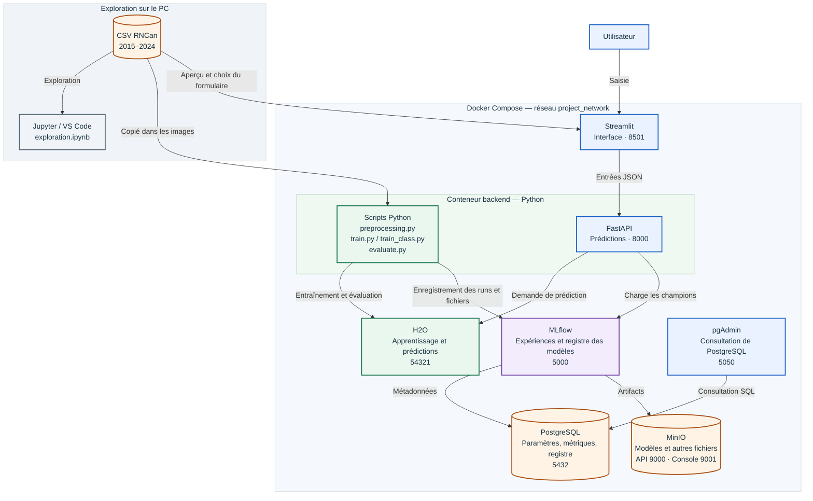

# TP C73 — Véhicules du Canada

Prédiction de la consommation de carburant et classification de la note de smog avec H2O, MLflow, FastAPI et Streamlit.

## 1. Présentation

Ce projet réalise deux tâches à partir des caractéristiques d'un véhicule :

- **Régression** : prédire sa consommation combinée de carburant, en litres aux 100 kilomètres.
- **Classification multiclasse** : prédire sa catégorie de note de smog : `Note faible`, `Note moyenne` ou `Note elevee`.

Le modèle de régression est un Random Forest entraîné avec H2O. Pour la classification, H2O AutoML compare plusieurs algorithmes. MLflow conserve les expérimentations et les modèles retenus. L'utilisateur entre les caractéristiques dans Streamlit, qui interroge l'API FastAPI pour obtenir les deux prédictions.

## 2. Données et préparation

Le fichier provient de **Ressources naturelles Canada** : [cotes de consommation de carburant](https://open.canada.ca/data/en/dataset/98f1a129-f628-4ce4-b24d-6f16bf24dd64).

Le [CSV utilisé](data/my2015-2024-fuel-consumption-ratings.csv) est inclus dans le dépôt. Il contient **10 060 lignes et 15 colonnes**, pour les années modèles 2015 à 2024.

Le notebook [exploration.ipynb](notebooks/exploration.ipynb) sert à examiner les données, leurs distributions et les valeurs manquantes. Le script [preprocessing.py](src/preprocessing.py) applique la préparation utilisée par l'entraînement et l'évaluation :

1. Lire le CSV avec pandas.
2. Garder les années modèles **2017 à 2024**, car la note de smog manque pour 2015 et 2016.
3. Créer la colonne `Classe smog` à partir de `Smog rating`.
4. Séparer les données selon l'année modèle.

### Catégories de smog

| Note d'origine | Catégorie du projet | Nombre de lignes |
|---|---|---:|
| 1 à 3 | Note faible | 2 485 |
| 4 à 6 | Note moyenne | 3 709 |
| 7 à 10 | Note elevee | 1 632 |

Une **note élevée est meilleure** : elle correspond à moins d'émissions de polluants responsables du smog. Ces trois regroupements sont définis pour ce projet ; ils ne sont pas des catégories officielles. La note de smog ne mesure pas directement la consommation ni les émissions de CO₂.

### Séparation des données

| Ensemble | Années modèles | Lignes | Utilisation |
|---|---|---:|---|
| Entraînement | 2017–2022 | 6 118 | Apprendre les relations entre les caractéristiques et la cible |
| Validation | 2023 | 919 | Comparer les configurations et choisir les champions |
| Test final | 2024 | 789 | Évaluer les champions après leur sélection |

Il reste **7 826 lignes** après le filtre sur les années. Le partage est chronologique, selon l'année modèle, et non un partage aléatoire 80/20.

Les deux modèles utilisent les mêmes sept variables explicatives :

| Colonne du CSV | Signification |
|---|---|
| `Model year` | Année modèle |
| `Make` | Marque |
| `Vehicle class` | Catégorie de véhicule |
| `Engine size (L)` | Cylindrée |
| `Cylinders` | Nombre de cylindres |
| `Transmission` | Type de transmission |
| `Fuel type` | Type de carburant |

Les mesures de consommation, de CO₂ et la note de smog ne font pas partie des entrées. Cela évite de fournir directement la réponse, ou une mesure très proche de la réponse, au modèle.

## 3. Architecture

Le diagramme Mermaid ci-dessous s'affiche directement sur GitHub. Les couleurs regroupent les rôles : **bleu** pour l'interface, **vert** pour le traitement, **violet** pour MLflow et **orange** pour le stockage.



Les flèches montrent les principaux appels et enregistrements. Les réponses reviennent au demandeur : H2O renvoie ses prédictions à FastAPI, puis FastAPI les renvoie à Streamlit. Pour le test final, `evaluate.py` charge aussi les champions depuis MLflow. Les scripts utilisent les bibliothèques Python H2O et MLflow pour communiquer avec les serveurs.

- **Jupyter** sert à l'exploration. Le notebook n'est pas envoyé à H2O : ce sont les scripts Python qui lui transmettent les données et les instructions.
- **H2O** fonctionne dans son propre conteneur Java. Il entraîne les modèles et calcule les prédictions.
- **Le conteneur backend** contient Python, FastAPI et les scripts. Lancer `src/train.py` dans ce conteneur exécute un script ; cela n'appelle pas une route FastAPI.
- **MLflow** organise les runs et le registre. PostgreSQL conserve les métadonnées ; MinIO conserve les fichiers, appelés *artifacts*.
- **Streamlit** appelle deux routes FastAPI. Les prédictions utilisent les champions déjà entraînés. Cliquer sur « Prédire » ne relance pas l'entraînement.

## 4. Structure du dépôt

```text
TP-C73/
├── api/
│   ├── Dockerfile
│   └── main.py                  # API FastAPI
├── app/
│   ├── Dockerfile
│   ├── app.py                   # Interface Streamlit
│   └── requirements.txt
├── data/
│   └── my2015-2024-fuel-consumption-ratings.csv
├── docker/
│   └── mlflow/Dockerfile
├── notebooks/
│   ├── exploration.ipynb
│   └── verification_infrastructure.ipynb
├── src/
│   ├── preprocessing.py         # Préparation et séparation
│   ├── train.py                 # Expériences Random Forest
│   ├── train_class.py           # Expériences AutoML
│   ├── predict.py               # Essai du champion de régression
│   ├── predict_class.py         # Essai du champion de classification
│   └── evaluate.py              # Test final et enregistrement MLflow
├── .dockerignore
├── .gitignore
├── docker-compose.yml
├── requirements.txt
└── README.md
```

Le dossier `models/` est réservé aux exports éventuels. Les modèles utilisés par l'application sont chargés depuis MLflow et stockés dans MinIO. `.env.local` est créé sur chaque machine et ignoré par Git.

## 5. Première installation

### Prérequis

- Git pour cloner le dépôt, ou le téléchargement ZIP depuis GitHub.
- Docker avec Docker Compose v2, démarré sur la machine.
- Les ports indiqués dans la section « Applications » disponibles.
- VS Code avec les extensions Python et Jupyter si l'on souhaite ouvrir les notebooks.

Les images installent leurs dépendances. Python et Java ne sont pas nécessaires sur le PC pour exécuter les services Docker. Le backend utilise Python 3.12, Java 17, H2O 3.46.0.12 et MLflow 3.16.0. Les versions Python sont fixées dans les fichiers `requirements.txt` ; les images PostgreSQL, MinIO et pgAdmin sont fixées dans Compose. H2O dispose de deux threads et d'un maximum de 2 Go pour sa mémoire Java ; les autres services ont aussi besoin de mémoire.

### 5.1. Récupérer le projet

```bash
git clone https://github.com/PinkPantr/TP-C73.git
cd TP-C73
```

Toutes les commandes suivantes se lancent depuis ce dossier, à côté de `docker-compose.yml`.

### 5.2. Créer `.env.local`

Créer ce fichier à la racine avec ces valeurs de démonstration, compatibles avec le Compose du dépôt :

```dotenv
AWS_ACCESS_KEY_ID=user
AWS_SECRET_ACCESS_KEY=password
PGPASSWORD=password
PGADMIN_DEFAULT_EMAIL=admin@tp.local
PGADMIN_DEFAULT_PASSWORD=password
```

Les variables `AWS_...` permettent à MLflow d'accéder à MinIO avec son API compatible S3. Elles ne correspondent pas à un compte AWS. `PGPASSWORD` fournit le mot de passe PostgreSQL à MLflow. Les deux dernières variables définissent le compte de connexion à pgAdmin lors de sa première initialisation.

### 5.3. Construire les images et démarrer le stockage et H2O

```bash
docker compose build
docker compose up -d --wait postgres minio mlflow h2o pgadmin
```

H2O utilise la même image que le backend : cette image doit donc être construite avant son démarrage. `--wait` attend que les services disposant d'un contrôle de santé soient prêts.

### 5.4. Créer le bucket MinIO

1. Ouvrir [MinIO](http://localhost:9001).
2. Se connecter avec `user` et `password`.
3. Créer un bucket nommé **`mlflow`**, en minuscules.
4. Garder les options de versioning, object locking et quota désactivées pour ce TP.

Le nom doit correspondre à `s3://mlflow` dans `docker-compose.yml`. Il suffit de créer ce bucket une fois par installation.

### 5.5. Entraîner les modèles

Au premier lancement, les champions n'existent pas encore. FastAPI charge le champion de régression au démarrage : on entraîne donc les modèles avec des conteneurs temporaires, avant de lancer l'API.

```bash
docker compose run --rm --no-deps backend python src/train.py
docker compose run --rm --no-deps backend python src/train_class.py
```

`run` crée un conteneur pour exécuter le script. `--rm` retire ce conteneur après son exécution, mais conserve les runs et les modèles enregistrés dans les volumes. `--no-deps` utilise les serveurs déjà démarrés à l'étape 5.3.

Ces deux commandes lancent les grilles complètes décrites dans la section « Expérimentations ». Elles doivent être exécutées l'une après l'autre.

### 5.6. Enregistrer les champions dans MLflow

Dans [MLflow](http://localhost:5000), choisir la vue **Model training**.

1. Dans `C73-Regression`, comparer les runs sur `validation_rmse` : le plus petit score est préférable. Consulter aussi MAE et R².
2. Ouvrir le modèle enregistré dans le run retenu, puis utiliser l'action d'enregistrement au registre (*Register model*). Utiliser le nom **`regression`**.
3. Dans **Model registry**, ouvrir `regression`, puis la version retenue. Lui attribuer l'alias **`champion`**.
4. Répéter pour `C73-Classification`, en comparant `validation_logloss`. Enregistrer le modèle retenu sous **`classification`**, puis attribuer **`champion`** à sa version.

Les deux adresses attendues par le code sont :

```text
models:/regression@champion
models:/classification@champion
```

`champion` doit être un **alias de version**, pas seulement un tag ou le nom d'un run. Les numéros de version sont propres à chaque installation : il faut choisir les versions créées sur sa machine.

### 5.7. Démarrer l'API et l'interface

```bash
docker compose up -d --wait backend frontend
docker compose ps
```

Ouvrir [Streamlit](http://localhost:8501), remplir le formulaire et cliquer sur **Prédire**. La consommation prédite et la classe de smog s'affichent sous le bouton.

## 6. Applications et utilisation

| Application | Adresse sur le PC | Rôle |
|---|---|---|
| Streamlit | http://localhost:8501 | Entrer les caractéristiques et afficher les résultats |
| FastAPI | http://localhost:8000/docs | Documentation interactive et essais des routes |
| MLflow | http://localhost:5000 | Comparer les runs, consulter les modèles et artifacts |
| MinIO | http://localhost:9001 | Consulter les fichiers du bucket `mlflow` |
| H2O Flow | http://localhost:54321 | Consulter le serveur H2O |
| pgAdmin | http://localhost:5050 | Explorer les tables PostgreSQL |
| PostgreSQL | `localhost:5432` | Connexion avec un client SQL ; ce n'est pas une page Web |
| MinIO API | `localhost:9000` | Accès compatible S3 ; la console est sur 9001 |

### Routes FastAPI

| Méthode | Route | Résultat |
|---|---|---|
| GET | `/health` | `{"status": "ok"}` si l'API répond |
| POST | `/predict` | `{"prediction": ...}` : consommation en L/100 km |
| POST | `/predict_class` | `{"classification": ...}` : catégorie de smog |

Exemple de corps JSON à saisir dans `/docs` avec **Try it out** :

```json
{
  "model_year": 2024,
  "make": "Acura",
  "vehicle_class": "Full-size",
  "engine_size": 1.5,
  "cylinders": 4,
  "transmission": "AV7",
  "fuel_type": "Z"
}
```

Les catégories doivent reprendre les valeurs du CSV. Streamlit propose les valeurs disponibles dans ses listes déroulantes. Les adresses comme `http://backend:8000` et `http://mlflow:5000` servent entre conteneurs ; dans le navigateur du PC, utiliser `localhost`.

### Consulter PostgreSQL avec pgAdmin

1. Se connecter à pgAdmin avec le compte choisi dans `.env.local`.
2. Ajouter un serveur nommé, par exemple, `C73 PostgreSQL`.
3. Dans l'onglet de connexion, saisir : hôte `postgres`, port `5432`, base de maintenance `PostgresDB`, utilisateur `user`, mot de passe `password`.
4. Ouvrir **Databases → PostgresDB → Schemas → public → Tables**.
5. Consulter par exemple `experiments`, `runs`, `params` ou `metrics` avec **View/Edit Data**.

L'hôte est `postgres` parce que pgAdmin fonctionne dans Docker. Les fichiers des modèles se trouvent dans MinIO, pas dans ces tables.

## 7. Expérimentations et champions

### Régression : Random Forest

[train.py](src/train.py) teste toutes les combinaisons suivantes, soit **36 runs par exécution** :

| Paramètre | Valeurs |
|---|---|
| `ntrees` | 50, 100, 200, 300, 400, 500 |
| `max_depth` | 5, 10, 20, 30, 40, 50 |
| `seed` | 42 |

Chaque run enregistre les paramètres, MAE, RMSE, R² de validation et le modèle. Le critère principal choisi est **RMSE**, qui donne davantage de poids aux grosses erreurs.

Le champion retenu utilise **200 arbres et une profondeur maximale de 30**. Les profondeurs 40 et 50 ont donné le même RMSE avec 200 arbres ; la limite de 30 a été retenue.

### Classification : H2O AutoML

[train_class.py](src/train_class.py) teste **six configurations AutoML par exécution** :

| Paramètre | Valeurs |
|---|---|
| `max_models` | 5, 10, 20 |
| `balance_classes` | True, False |
| `seed` | 42 |
| `sort_metric` | logloss |

Les candidats apprennent sur l'ensemble d'entraînement. Le classement AutoML utilise l'ensemble de validation fourni par `leaderboard_frame`. Chaque run MLflow conserve le score et le modèle du **leader**, tandis que le leaderboard complet s'affiche dans le terminal. AutoML peut ajouter des ensembles au-delà du nombre de modèles de base demandé.

Le champion retenu est un **XGBoost**. Les six configurations ont obtenu le même meilleur logloss de validation à la précision enregistrée. Cela ne signifie pas que tous leurs modèles candidats sont équivalents. Le champion issu du premier essai AutoML a été conservé.

### Versions retenues sur l'installation de développement

| Modèle MLflow | Alias | Version | Run d'origine |
|---|---|---:|---|
| `regression` | `champion` | 2 | `f55101b21926445a97e95dbf0cd5a35d` |
| `classification` | `champion` | 1 | `f6bbaa2083fb4fbc9820478bcc80b81c` |

Ces identifiants décrivent les modèles utilisés pour les résultats ci-dessous. Ils ne sont pas importés automatiquement lors du clonage du dépôt.

## 8. Évaluation finale et résultats

Après la sélection des champions, lancer :

```bash
docker compose exec backend python src/evaluate.py
```

Le script charge les deux champions, calcule leurs scores sur les **789 lignes de 2024** et crée un run `test-final-champions` dans l'expérience **`C73-Evaluation-finale`**. Il enregistre cinq métriques, le nombre de lignes, les identifiants H2O des modèles et l'artifact `matrice_confusion.txt`.

### Résultats obtenus

| Tâche | Métrique | Validation 2023 | Test final 2024 |
|---|---|---:|---:|
| Régression | MAE, L/100 km | 0,5002 | 0,5936 |
| Régression | RMSE, L/100 km | 0,8329 | 0,8857 |
| Régression | R² | 0,9140 | 0,9015 |
| Classification | Logloss | 0,4671 | 0,9987 |
| Classification | Erreur moyenne par classe | — | 25,18 % |

Run d'évaluation : `a22fee99e0da4323b13925c669de7b6f`. Les valeurs sont arrondies dans ce tableau ; MLflow conserve leur précision complète.

### Matrice de confusion du test final

Les lignes représentent les classes réelles et les colonnes les classes prédites.

| Classe réelle / prédite | Note elevee | Note faible | Note moyenne | Total |
|---|---:|---:|---:|---:|
| Note elevee | **169** | 10 | 120 | 299 |
| Note faible | 6 | **117** | 13 | 136 |
| Note moyenne | 7 | 57 | **290** | 354 |
| Total | 182 | 184 | 423 | 789 |

Il y a **576 bonnes prédictions sur 789**, soit **73,00 % d'exactitude**. Cette valeur est calculée à partir de la matrice ; le script ne l'enregistre pas actuellement comme métrique séparée.

### Interprétation et limites

- L'erreur absolue moyenne de consommation est d'environ **0,59 L/100 km** sur le test final. Le RMSE est légèrement supérieur à celui de validation.
- Un R² de 0,9015 indique environ 90,15 % de variation expliquée sur ce test. Ce n'est pas un pourcentage de prédictions exactes.
- La classification est moins performante sur le test selon le logloss. Elle reconnaît 169 des 299 exemples de `Note elevee` et en classe 120 comme `Note moyenne`.
- Les catégories de smog sont regroupées pour le TP. Le modèle ne prédit pas la note officielle exacte.
- Un même modèle de véhicule peut réapparaître sur plusieurs années. Le partage par année n'assure donc pas une séparation par famille de véhicules.
- Le formulaire permet de combiner librement les caractéristiques. Certaines combinaisons peuvent être absentes du jeu d'entraînement ou ne pas correspondre à un véhicule réel.
- Ces résultats portent sur ce fichier et ce partage. Ils ne démontrent pas la même performance sur tous les véhicules ou les années futures.

Le test final sert à rendre compte des performances après la sélection. Il ne sert pas à continuer le choix des paramètres. Relancer le même script pour enregistrer ou vérifier les mêmes scores ne réentraîne pas les modèles.

## 9. Commandes courantes

Ces commandes s'utilisent après la première installation et l'enregistrement des champions.

```bash
# Démarrer les services existants
docker compose up -d

# Reconstruire les images après une modification du code
docker compose up -d --build

# Afficher l'état des conteneurs
docker compose ps

# Afficher les logs de l'API
docker compose logs backend

# Relancer les expérimentations, seulement si nécessaire
docker compose exec backend python src/train.py
docker compose exec backend python src/train_class.py

# Essayer les champions sur trois exemples de validation
docker compose exec backend python src/predict.py
docker compose exec backend python src/predict_class.py

# Évaluer les champions et enregistrer les scores finaux
docker compose exec backend python src/evaluate.py

# Recharger le champion de régression après un changement d'alias
docker compose restart backend

# Arrêter les services en conservant leurs données
docker compose stop
```

Le code est copié dans les images Docker lors du build. Une simple commande `restart` ne copie pas les dernières modifications du PC. Un changement d'alias MLflow, en revanche, ne demande pas de rebuild : le redémarrage du backend recharge le champion de régression. Le champion de classification est actuellement chargé à chaque requête.

### Conservation des données

PostgreSQL, MinIO et pgAdmin utilisent des volumes Docker. Arrêter les conteneurs conserve leurs données. Les volumes ne sont pas envoyés à GitHub. Sur une autre machine, suivre la première installation, puis entraîner et enregistrer les champions.

`docker compose down -v` supprime les volumes du projet : les runs, modèles et réglages qui y sont stockés seraient perdus. Ce n'est pas la commande utilisée pour arrêter normalement le TP.

## 10. Problèmes rencontrés

| Message ou problème | Explication et action |
|---|---|
| `.env.local` introuvable | Créer le fichier décrit à l'étape 5.2. |
| Bucket `mlflow` introuvable | Créer le bucket dans MinIO avant de sauvegarder les modèles. |
| Modèle ou alias `champion` introuvable | Terminer l'entraînement et l'enregistrement des deux champions. Un tag ne remplace pas un alias. |
| H2O ne trouve pas `c73-tp-backend:latest` | Lancer `docker compose build` avant de démarrer H2O. |
| Une modification Python n'est pas prise en compte | Reconstruire l'image du service concerné. |
| `localhost:5432` ne montre aucune page | PostgreSQL utilise un protocole SQL. Le consulter avec pgAdmin. |
| Port déjà utilisé | Arrêter l'autre projet utilisant les mêmes ports. |
| `Invalid Host header` dans MLflow | Le Compose inclut les hôtes autorisés. Après une modification de cette configuration, recréer le service avec `docker compose up -d mlflow`. |
| Avertissement Git dans MLflow | Git n'est pas installé dans l'image backend. Certaines métadonnées Git ne sont pas enregistrées ; cela n'a pas empêché les entraînements. |
| `artifact_path` est déprécié | Avertissement de MLflow 3.16. Les scripts utilisent encore cet argument et les modèles ont été enregistrés. |
| Échec GLM pendant AutoML | Un essai a rencontré `ArrayIndexOutOfBoundsException`. AutoML a poursuivi avec les autres candidats. La cause de cet échec n'a pas été déterminée. |

## 11. Références

- [Jeu de données RNCan](https://open.canada.ca/data/en/dataset/98f1a129-f628-4ce4-b24d-6f16bf24dd64)
- [Guide ÉnerGuide des véhicules](https://natural-resources.canada.ca/energy-efficiency/transportation-energy-efficiency/personal-vehicles/energuide-vehicles)
- Matériel C73 : `PROJET DE SESSION – Choix 2`, exemples `mlops-pipeline-v1` et `mlops-pipeline-v2`.
- Matériel C74 : exercice `032-manip_scoring_algo`, pour les mesures de classification et la matrice de confusion.
- [H2O AutoML](https://docs.h2o.ai/h2o/latest-stable/h2o-docs/automl.html)
- [MLflow](https://mlflow.org/docs/latest/)
- [FastAPI](https://fastapi.tiangolo.com/)
- [Streamlit](https://docs.streamlit.io/)
- [Diagrammes Mermaid dans GitHub](https://docs.github.com/en/get-started/writing-on-github/working-with-advanced-formatting/creating-diagrams)
