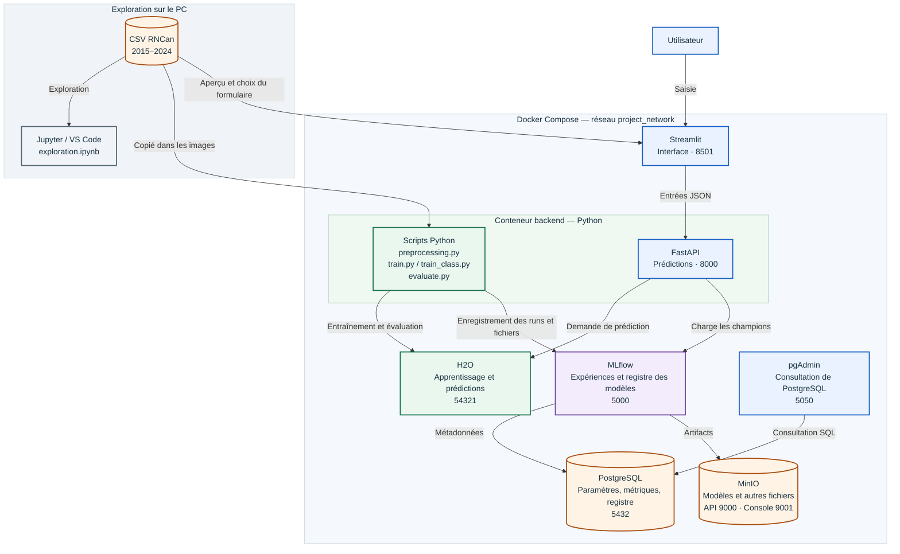

# TP C73 — Véhicules du Canada

## Présentation

Ce projet utilise les caractéristiques d'un véhicule pour faire deux prédictions :

- **Régression** : la consommation combinée de carburant, en L/100 km.
- **Classification multiclasse** : la catégorie de note de smog.

H2O entraîne les modèles. MLflow enregistre les expériences. Streamlit permet de saisir les données et d'afficher les prédictions reçues de FastAPI.

## Données

Le [fichier CSV](data/my2015-2024-fuel-consumption-ratings.csv) vient de [Ressources naturelles Canada](https://open.canada.ca/data/en/dataset/98f1a129-f628-4ce4-b24d-6f16bf24dd64). Il contient **10 060 lignes et 15 colonnes**, de 2015 à 2024.

On garde les années **2017 à 2024**, car la note de smog manque avant 2017. Il reste **7 826 lignes**.

| Ensemble | Années | Lignes | Rôle |
|---|---|---:|---|
| Entraînement | 2017–2022 | 6 118 | Entraîner les modèles |
| Validation | 2023 | 919 | Comparer les modèles et choisir les champions |
| Test final | 2024 | 789 | Évaluer les champions |

Les sept variables explicatives sont : **année modèle, marque, catégorie du véhicule, cylindrée, cylindres, transmission et carburant**. Les réponses à prédire ne sont pas utilisées comme entrées.

Pour la classification, on regroupe la note de smog :

| Note | Classe |
|---|---|
| 1 à 3 | Note faible |
| 4 à 6 | Note moyenne |
| 7 à 10 | Note elevee |

Une note élevée correspond à moins de polluants responsables du smog. Ces groupes sont définis pour le TP, pas par le gouvernement.

## Architecture



- **Jupyter** : explorer les données avant l'entraînement.
- **H2O** : entraîner les modèles et faire les prédictions.
- **MLflow** : suivre les runs et conserver les modèles champions.
- **PostgreSQL** : stocker les paramètres, les métriques et les informations des runs.
- **MinIO** : stocker les fichiers (*artifacts*), dont les modèles.
- **FastAPI** : recevoir les données et retourner les prédictions.
- **Streamlit** : fournir l'interface utilisateur.
- **pgAdmin** : consulter les tables de PostgreSQL.

Les scripts d'entraînement et FastAPI utilisent le même conteneur `backend`. H2O fonctionne dans un autre conteneur. Une demande de prédiction utilise les modèles enregistrés, sans les entraîner à nouveau.

## Fichiers principaux

| Fichier | Rôle |
|---|---|
| `notebooks/exploration.ipynb` | Exploration des données |
| `src/preprocessing.py` | Préparation et séparation des données |
| `src/train.py` | Entraînement de la régression |
| `src/train_class.py` | Entraînement de la classification |
| `src/evaluate.py` | Test final et enregistrement des scores |
| `api/main.py` | API FastAPI |
| `app/app.py` | Interface Streamlit |
| `docker-compose.yml` | Configuration des services Docker |

## Première installation

Il faut **Git et Docker avec Docker Compose v2**. Docker doit être démarré et les ports du projet doivent être libres. Les dépendances Python et Java sont installées dans les images.

### 1. Cloner le dépôt

```bash
git clone https://github.com/PinkPantr/TP-C73.git
cd TP-C73
```

Toutes les commandes suivantes se lancent dans le dossier `TP-C73`.

### 2. Créer `.env.local`

Créer ce fichier à côté de `docker-compose.yml`. Il contient les identifiants de démonstration utilisés par les services :

```dotenv
AWS_ACCESS_KEY_ID=user
AWS_SECRET_ACCESS_KEY=password
PGPASSWORD=password
PGADMIN_DEFAULT_EMAIL=admin@tp.local
PGADMIN_DEFAULT_PASSWORD=password
```

Les variables `AWS_...` servent à la connexion à MinIO. `.env.local` n'est pas envoyé sur GitHub.

### 3. Construire les images et démarrer les premiers services

```bash
docker compose build
docker compose up -d --wait postgres minio mlflow h2o pgadmin
```

### 4. Créer le bucket MinIO

Ouvrir http://localhost:9001 et se connecter avec `user` / `password`.

Créer un bucket nommé **`mlflow`**. Garder versioning, object locking et quota désactivés. Cette étape se fait une seule fois.

### 5. Entraîner les modèles

```bash
docker compose run --rm --no-deps backend python src/train.py
docker compose run --rm --no-deps backend python src/train_class.py
```

Exécuter les commandes l'une après l'autre. Elles utilisent des conteneurs temporaires, car FastAPI a besoin d'un champion pour démarrer. Les résultats restent enregistrés dans MLflow.

### 6. Choisir les champions dans MLflow

Ouvrir http://localhost:5000, dans la vue **Model training**.

1. Dans `C73-Regression`, comparer les runs avec `validation_rmse`. Le plus petit score est préférable.
2. Ouvrir le modèle du run retenu et utiliser **Register model**. Le nommer **`regression`**.
3. Dans **Model registry**, ouvrir sa version et ajouter l'alias **`champion`**.
4. Faire la même chose dans `C73-Classification`, avec `validation_logloss`. Nommer le modèle **`classification`** et lui donner l'alias **`champion`**.

Le code utilise `models:/regression@champion` et `models:/classification@champion`. Il faut un **alias**, pas seulement un tag.

### 7. Démarrer FastAPI et Streamlit

```bash
docker compose up -d --wait backend frontend
docker compose ps
```

Ouvrir Streamlit, remplir les sept champs et cliquer sur **Prédire**. La consommation et la classe de smog s'affichent.

## Applications

| Application | Adresse |
|---|---|
| Streamlit | http://localhost:8501 |
| FastAPI — documentation et essais | http://localhost:8000/docs |
| MLflow | http://localhost:5000 |
| MinIO — console | http://localhost:9001 |
| H2O Flow | http://localhost:54321 |
| pgAdmin | http://localhost:5050 |

FastAPI propose `GET /health`, `POST /predict` pour la régression et `POST /predict_class` pour la classification.

Dans pgAdmin, ajouter un serveur avec l'hôte `postgres`, le port `5432`, la base `PostgresDB`, l'utilisateur `user` et le mot de passe `password`. PostgreSQL ne s'ouvre pas comme une page Web.

## Modèles et expérimentations

| Tâche | Essais | Champion retenu |
|---|---|---|
| Régression | 36 configurations Random Forest | 200 arbres, profondeur maximale de 30 |
| Classification | 6 configurations H2O AutoML | XGBoost |

Pour Random Forest, on teste `ntrees` = 50, 100, 200, 300, 400, 500 et `max_depth` = 5, 10, 20, 30, 40, 50.

Pour AutoML, on teste `max_models` = 5, 10, 20 et `balance_classes` = True, False. Chaque run MLflow enregistre le meilleur modèle de cet essai AutoML. Les six essais ont obtenu le même meilleur logloss de validation ; le champion initial a été conservé.

La valeur `seed=42` est gardée pour tous les essais. Les champions sont choisis avec les résultats de **validation**, avant le test final.

## Évaluation finale

```bash
docker compose exec backend python src/evaluate.py
```

Le script évalue les champions sur les **789 lignes de 2024**. Les scores sont enregistrés dans **`C73-Evaluation-finale`**, dans le run **`test-final-champions`**. La matrice de confusion est disponible dans **Artifacts → `matrice_confusion.txt`**.

| Métrique | Validation | Test final |
|---|---:|---:|
| MAE — régression, L/100 km | 0,5002 | 0,5936 |
| RMSE — régression, L/100 km | 0,8329 | 0,8857 |
| R² — régression | 0,9140 | 0,9015 |
| Logloss — classification | 0,4671 | 0,9987 |
| Erreur moyenne par classe | — | 25,18 % |

La classification donne **576 bonnes prédictions sur 789**, soit **73 % d'exactitude**, calculée à partir de la matrice de confusion.

### Limites

- La classification confond surtout `Note elevee` avec `Note moyenne`.
- Un même modèle de véhicule peut apparaître sur plusieurs années.
- Certaines combinaisons saisies dans Streamlit peuvent ne pas correspondre à un véhicule réel.
- Ces scores décrivent le test de 2024. On ne l'utilise pas pour continuer à choisir les paramètres.

## Commandes utiles

Après la première installation :

```bash
# Démarrer le projet
docker compose up -d

# Appliquer les modifications du code
docker compose up -d --build

# Voir l'état des services
docker compose ps

# Recharger le champion de régression après un changement d'alias
docker compose restart backend

# Arrêter le projet
docker compose stop
```

Les données de MLflow et MinIO restent dans les **volumes Docker**. Elles ne sont pas copiées avec GitHub : une nouvelle installation doit entraîner et enregistrer ses modèles. `docker compose down -v` supprime ces volumes.

## Matériel utilisé

- C73 : `PROJET DE SESSION – Choix 2` et les exemples `mlops-pipeline-v1` et `mlops-pipeline-v2`.
- C74 : `032-manip_scoring_algo`, pour la matrice de confusion.
- Documentation [H2O](https://docs.h2o.ai/h2o/latest-stable/h2o-docs/automl.html) et [MLflow](https://mlflow.org/docs/latest/).
